## [CBAM(2018-ECCV)](https://zhuanlan.zhihu.com/p/106084464)

Convolutional Block Attention Module

<p align="center">
	  
</p>

影响卷积神经网络模型性能的3个因素：深度（ResNet）、宽度（Wide-ResNet）、基数（ResNext）、注意力。

1. Channel attention module

   <p align="center">
   	  
   </p>

   <table><tr><td bgcolor=yellow>We argue that max-pooled features which encode the degree of the most salient part can compensate the averaged-pooled features which encode global statstics softly.</td></tr></table>

2. Spatial attention modeule

   <p align="center">
   	  
   </p>

   1.  **在轴的方向上对不同特征图上相同位置的像素值**进行全局的MaxPooling和AvgPooling操作，分别得到两个spatial attention map并将其concatenate，shape为[2, H, W]。
   2.  再利用一个7\*7的卷积对这个feature map进行卷积，后接一个sigmoid函数。得到一个与原特征图维数相同的加上空间注意力权重的空间矩阵。（7\*7卷积核的原因是具有更大的感受野）

## [ROI Pooling](https://blog.csdn.net/zjucor/article/details/79325377)

**ROI Pooling** 存在量化误差（mis-alignment）

- 将候选框边界量化为整数点坐标值。

- 将量化后的边界区域平均分割成 k x k 个单元(bin)，对每一个单元的边界进行量化。

  <p align="center">
  	  
  </p>

  <p align="center">
  	 
  </p>

  <table><tr><td bgcolor=yellow>mis-alignment对小目标的影响更加明显。</td></tr></table>

**ROI Align**

- 遍历每一个候选区域，保持浮点数边界不做量化。

- 将候选区域分割成k x k个单元，每个单元的边界也不做量化。

- 在每个单元中计算固定四个坐标位置，用双线性内插的方法计算出这四个位置的值，然后进行最大池化操作。

- 修改反向传播。

  <p align="center">
  	  
  </p>

  <p align="center">
  	  
  </p>

## [UNet++](https://zhuanlan.zhihu.com/p/44958351)

<p align="center">
	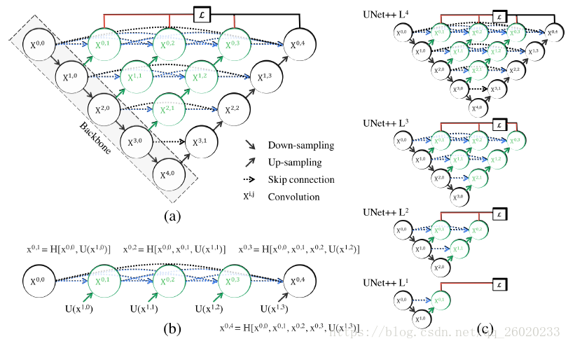  
</p>

文章改进skip connection，并引入deep supervision的思路。网络的loss函数是由不同层得到的分割图的loss的平均，每层的loss函数为DICE LOSS和Binary cross-entropy LOSS之和。作者认为引入DSN（deep supervision net）后，通过model pruning（模型剪枝）能够实现模型的两种模式：高精度模式和高速模式。

## [小目标检测](https://blog.csdn.net/m_buddy/article/details/96503647)

#### 多尺度（分辨率）对图像分类和检测的影响

1. **对图像分类的影响**
   1. 当训练图片的尺度与测试图片的尺度相差较大时性能会很差，越接近性能越好。
   2. 在高分辨下预训练得到的模型，在低分辨数据下finetune得到的结果比专门设计针对小目标的模型效果好。
2. **对目标检测的影响**
   1. <font color=blue size=3>upsample确实一定程度上可以提高性能，但是并不显著</font>，这是因为upsample提高了小目标的检测效果，但会让本来正常大小或者本来就大的目标过大，性能下降。
   2. 训练网络需要使用大量样本，样本损失会导致性能下降，丢弃样本导致训练集丰富性下降，尤其是抛弃的那个尺度的样本。

#### 难点分析

1. **网络的stride特性**

   检测网络中一般使用CNN网络作为特征提取工具，在CNN网络中为了增大感受野使得CNN网络中的特征图不断缩小，面积较小的区域的信息自然就很难传递到后面的目标检测检测器中了。

2. **训练集的分布**（参考[SNIP(2018-CVPR)](https://blog.csdn.net/m_buddy/article/details/90454642)）

   在COCO数据集中大目标和小目标的大小比值是比较大的，这就为网络适应目标带来了一定的困难。

3. **网络损失函数**

   现有的检测网络中OHEM之类的训练样本选择机制，在正负样本选择的时候对小目标并不是很友好。

4. **CNN对于尺度变化的泛化能力较弱**

   CNN学习尺度不变性较难，就算网络表现出来具有一定的尺度泛化能力，也是通过大量的参数固定下来的，因而泛化能力较弱。

#### 方法总结

1. **从图像或特征的角度**

   既然使用最后一个stage的特征去做预测很难，那么可以考虑如下优化方式：

   1. 使用FPN在多个尺度上预测不同尺度的目标；
   2. 参考[SNIPER(2018-NIPS)](https://blog.csdn.net/Gentleman_Qin/article/details/84797882)，**<font color=blue size=3>区分大小目标，针对性优化</font>**；
      - 图像金字塔，**<font color=green size=3>生成固定大小的Positive Chip和Negative Chip</font>**。
   3. 放大输入图像（用超分辨率之类的有质量的方法）（训练时图像放大1.5到2倍，预测时放大4倍）或是切图多次检测；
   4. 使用**<font color=blue size=3>空洞卷积（dilated convolution）</font>**；

2. **从anchor角度**

   1. anchor的密度

      由检测所用feature map的stride决定，这个值与前景阈值密切相关，在密集的情况下可以使anchor加倍以增加对密集目标的检测能力（TextBoxes++，Pixel-Anchor）；

   2. anchor的范围

      RetinaNet中是anchor范围是32~512，这里应根据任务检测目标的范围确定，按需调整anchor范围，或目标变化范围太大如MS COCO，这时候应采用多尺度测试；

   3. anchor的形状数量

      RetinaNet每个位置预测三尺度三比例共9个形状的anchor，这样可以增加anchor的密度，但stride决定这些形状都是同样的滑窗步进，需考虑步进会不会太大，如RetinaNet框架前景阈值是0.5时，一般anchor大小是stride的4倍左右；

3. **对于使用ROI Pooling的网络**

   A Scale-Insensitive Convolutional Neural Network for Fast Vehicle Detection(2019-T-ITS) 认为小目标在Pooling之后会导致物体结构失真，于是提出了新的**<font color=blue size=3>Context-Aware RoI Pooling</font>**方法，有助于保留有用信息，下图是该方法与简单Pooling操作的对比：

   <p align="center">
   	  
   </p>

   <p align="center">
   	  
   </p>

4. **增加小目标数量**

   1. 在**<font color=blue size=3>Augmentation for small object detection</font>**中提到增加图像中小目标的数量（不影响其它目标检测的情况下，复制多个小目标），提升小目标被学习到的机会；
   2. 增加小目标图像在训练数据集中的数量，保证小目标能够被有效地学习；

5. **在对小目标的IoU阈值上**

   对小目标可以不使用严苛的阈值（0.5），可以考虑针对小目标使用**<font color=blue size=3>Cascade RCNN</font>**的思想，级联优化小目标的检测。

6. **回归损失函数上**

   在YOLO中按照不同的目标大小给了不同的损失函数加权系数：(2−*w*∗*h*)∗1.5，使用这样的策略其性能提升了1个点。

7. **小目标的GT**

   增大小目标的GT，从而变相加大目标，增加检测的能力。

## OpenPose（关键点）

[Realtime Multi-Person 2D Human Pose Estimation using Part Affinity Fields](https://www.cnblogs.com/taoshiqian/p/9335525.html)

​		能有效检测图像中多个人的2D姿态。使用PAFs (Part Affinity Fields，关键点亲和场，Affinity指两点配对的关联程度，表示关键点配对的置信程度)，来学习关键点和肢体。这种结构对global context（全局上下文）进行编码，自下而上进行解析。特点：多人，高精度，实时。通过序列结构神经网络的两个分支来联合学习：关键点位置、关键点之间的联系即PAF。

<p align="center">
	  
</p>

<p align="center">
	  
</p>

## Cascade RCNN

1. mismatch

   <p align="center">
   	
   </p>

   training阶段和inference阶段，第二阶段bbox回归器的输入分布是不一样的：training阶段的输入proposals质量更高（被采样过，IoU>threshold），inference阶段的输入proposals质量相对较差（没有被采样过，可能包括很多IoU<threshold的），这就是论文中提到**mismatch**问题，这个问题是固有存在的，通常threshold取0.5时，mismatch问题还不会很严重。

2. Cascade RCNN

   <p align="center">
   	  
   </p>

   - RPN提出的proposals大部分质量不高，导致没办法直接使用高阈值的detector，Cascade R-CNN使用cascade回归作为一种重采样的机制，逐stage提高proposal的IoU值，从而使得前一个stage重新采样过的proposals能够适应下一个有更高阈值的stage。
     - 每一个stage的detector都不会过拟合，都有足够满足阈值条件的样本。
     - 更深层的detector也就可以优化更大阈值的proposals。
     - 每个stage的H不相同，意味着可以适应多级的分布。
     - 在inference时，虽然最开始RPN提出的proposals质量依然不高，但在每经过一个stage后质量都会提高，从而和有更高IoU阈值的detector之间不会有很严重的mismatch。

## NMS

<p align="center">
	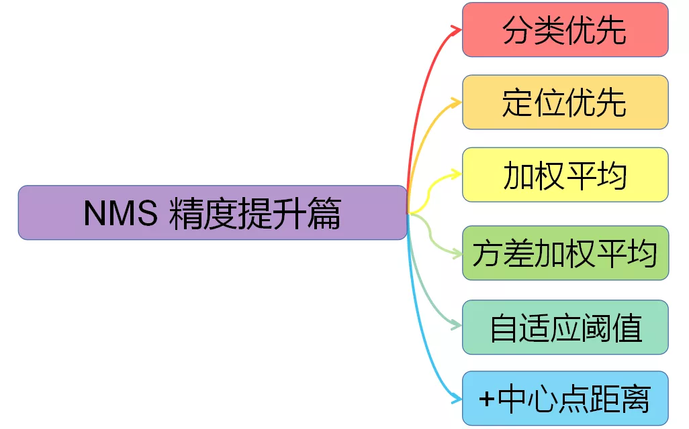  
</p>

对NMS进行分类，大致可分为以下六种，这里是依据它们在各自论文中的核心论点进行分类，这些算法可以同时属于多种类别。

1. 分类优先：传统NMS，Soft-NMS (ICCV 2017)

2. 定位优先：IoU-Guided NMS (ECCV 2018)

3. 加权平均：Weighted NMS (ICME Workshop 2017)

   <p align="center">    
       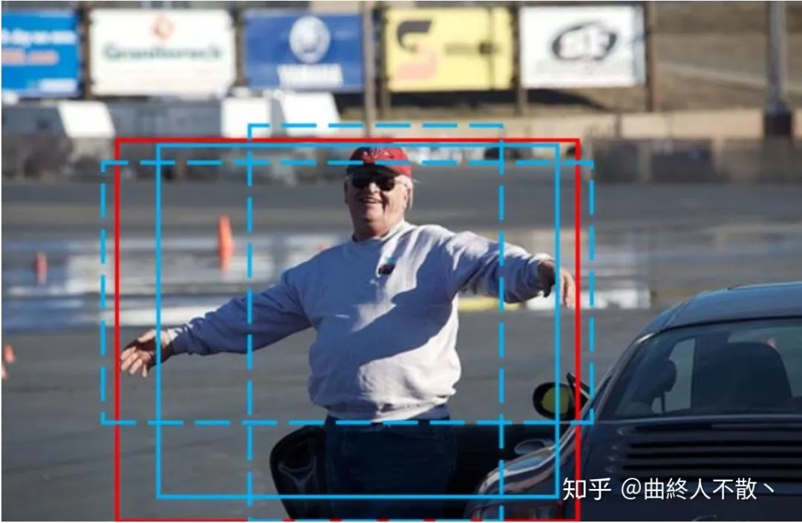  
   </p>

4. 方差加权平均：Softer-NMS (CVPR 2019)

5. 自适应阈值：Adaptive NMS (CVPR 2019)

6. +中心点距离：DIoU-NMS (AAAI 2020) 

   DIoU-NMS出现于Distance-IoU一文，研究者认为若相邻框的中心点越靠近当前最大得分框*M*的中心点，则其更有可能是冗余框。

   <p align="center">
   	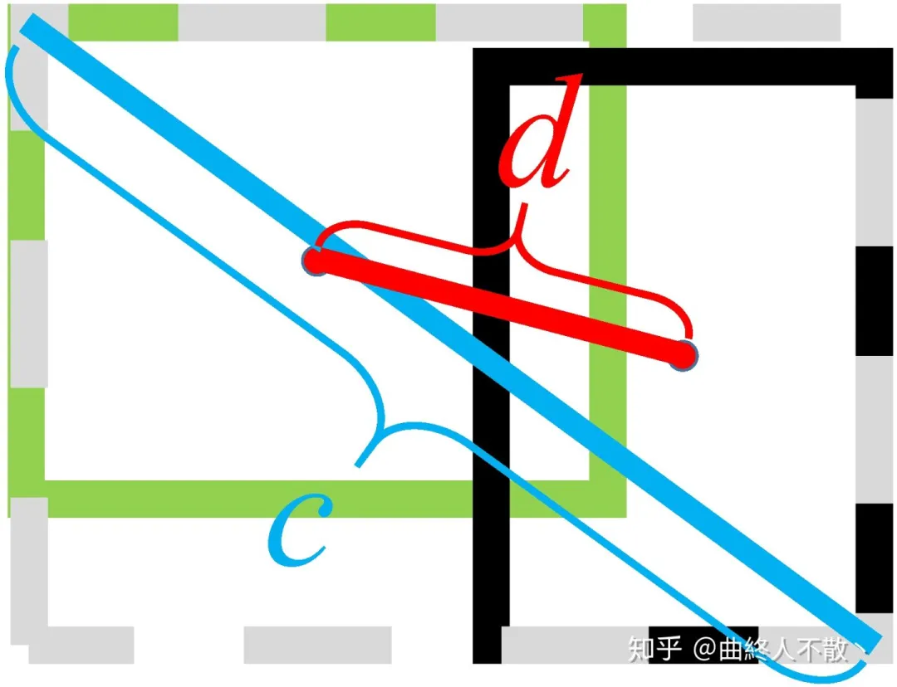  
   </p>

**总结：**

1. **<font color=blue size=3>加权平均法通常能够稳定获得精度与召回的提升。</font>**
2. 定位优先法、方差加权平均法与自适应阈值法需要修改模型，不够灵活。
3. **<font color=blue size=3>中心点距离法可作为额外惩罚因子与其他NMS变体结合。</font>**
4. 得分惩罚法会改变box的得分，打破了模型校准机制。
5. 运算效率的低下可能会限制它们的实时应用性。

## LOSS

[目标检测回归损失函数](https://mp.weixin.qq.com/s?__biz=MzI5MDUyMDIxNA==&mid=2247493294&idx=1&sn=d64822f1c2ca25901f7b707d78028364&chksm=ec1c0b57db6b82414c9177a13da5c1cceda8963785e22cb777b43892608c9ce71afc90c8d0c1&scene=21#wechat_redirect)

- smmoth-L1/L1/L2
- IOU/GIOU/DIOU/CIOU

## CycleGAN

<p align="center">
	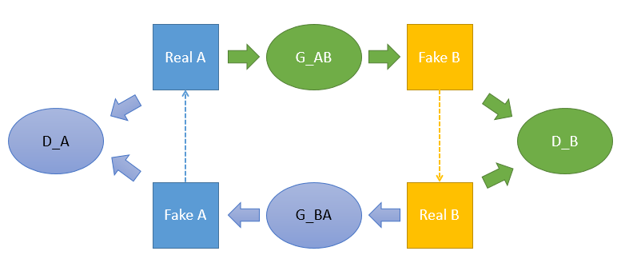  
</p>


<p align="center">
	  
</p>

**<font color=green size=3>loss</font>**

对于discriminator A：

<p align="center">
	  
</p>

对于discriminator B：

<p align="center">
	  
</p>

对于generator BA：

<p align="center">
	  
</p>

对于generator AB： 

<p align="center">
	  
</p>

​		对于generator添加重构误差项（cycle consistency loss），跟对偶学习一样，能够引导两个generator更好地完成encode和decode的任务。而两个D则起到纠正编码结果符合某个domain的风格的作用。


**<font color=green size=3>Tricks</font>**

- 在训练Discriminator的时候，不再仅仅把Generator最新生成的图片作为训练集喂给D，而是加上缓存的一些G在之前生成的图片， 这样可以一定程度上避免模型震荡。


**<font color=green size=3>Q & A</font>**

Q：去掉重构误差，模型是否还有效？

A：模型仍然有效，只是收敛比较慢，毕竟缺少了重构误差这样的强引导信息。以及，虽然实现了风格迁移，但是人物的一些属性改变了，比如可能出现『变性』、『变脸』，而姿态在转换的时候一般不出现错误。这表明，**对偶重构误差能够引导模型在迁移的时候保留图像固有的属性；而对抗loss则负责确定模型该学什么，该怎么迁移**。


<p align="center">
	  
</p>


Q：能不能不要完整的cycle，只做一半？

A：结论是不行，缺少了对偶的部分，就少了重构误差，仅仅依靠D_B来纠正G_AB是不够的。从讨论1来看，对偶的作用还是很大的，即使缺少了重构误差。

## BatchNorm and Dropout

**如何通过方差偏移理解批归一化与Dropout之间的冲突**

Dropout 与 BN 之间冲突的关键是网络状态切换过程中存在神经方差的（neural variance）不一致行为。试想若有图一中的神经响应 X，当网络从训练转为测试时，Dropout 可以通过其随机失活保留率（即 p）来缩放响应，并在学习中改变神经元的方差，而 BN 仍然维持 X 的统计滑动方差。这种方差不匹配可能导致数值不稳定（见下图中的红色曲线）。而随着网络越来越深，最终预测的数值偏差可能会累计，从而降低系统的性能。简单起见，作者们将这一现象命名为**<font color=green size=3>「方差偏移」</font>**。事实上，如果没有 Dropout，那么实际前馈中的神经元方差将与 BN 所累计的滑动方差非常接近（见下图中的蓝色曲线），这也保证了其较高的测试准确率。

<p align="center">
	  
</p>

作者采用了两种策略来探索如何打破这种局限。一个是在所有 BN 层后使用 Dropout，另一个就是修改 Dropout 的公式让它对方差并不那么敏感，就是**<font color=green size=3>「高斯Dropout」</font>**。

- 第一个方案比较简单，把Dropout放在所有BN层的后面就可以了，这样就不会产生方差偏移的问题，但实则有逃避问题的感觉。
- 第二个方案来自Dropout原文里提到的一种高斯Dropout，是对Dropout形式的一种拓展。作者进一步拓展了高斯Dropout，提出了一个均匀分布Dropout，这样做带来了一个好处就是这个形式的Dropout（又称为“Uout”）对方差的偏移的敏感度降低了，总得来说就是整体方差偏地没有那么厉害了。

## Normalization

我们将输入的 feature map shape 记为[N, C, H, W]，其中N表示batch size，即N个样本；C表示通道数；H、W分别表示特征图的高度、宽度。这几个方法主要的区别就是在：

1. BN是在batch上，对N、H、W做归一化，而保留通道 C 的维度。BN对较小的batch size效果不好。**<font color=red size=3>BN适用于固定深度的前向神经网络，如CNN，不适用于RNN；</font>**

2. LN在通道方向上，对C、H、W归一化，**<font color=red size=3>主要对RNN效果明显；</font>**

3. IN在图像像素上，对H、W做归一化，**<font color=red size=3>用在风格化迁移；</font>**

4. GN将channel分组，然后再做归一化；

   <p align="center">
   	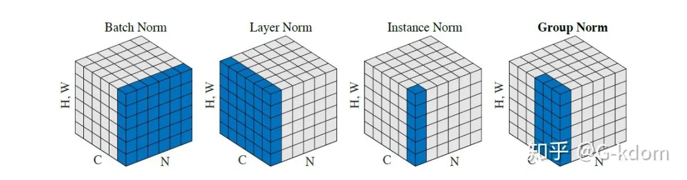  
   </p>

**BN 和 IN 可以**设置参数：`momentum`和`track_running_stats`来获得在**整体数据上更准确的均值和标准差**。**LN 和 GN 只能计算当前 batch 内数据的真实均值和标准差**。

### [Batch Normalization](https://arxiv.org/pdf/1502.03167.pdf)

- **为什么要进行BN呢？**

（1）在深度神经网络训练的过程中，通常以输入网络的每一个mini-batch进行训练，这样每个batch具有不同的分布，使模型训练起来特别困难。

（2）Internal Covariate Shift (ICS) 问题：在训练的过程中，激活函数会改变各层数据的分布，随着网络的加深，这种改变（差异）会越来越大，使模型训练起来特别困难，收敛速度很慢，会出现梯度消失的问题。

- **BN的主要思想**

针对每个神经元，**使数据在进入激活函数之前，沿着通道计算每个batch的均值、方差，‘强迫’数据保持均值为0，方差为1的正态分布**，避免发生梯度消失。具体来说，就是把第1个样本的第1个通道，加上第2个样本第1个通道 ...... 加上第 N 个样本第1个通道，求平均，得到通道 1 的均值（注意是除以 N×H×W 而不是单纯除以 N，最后得到的是一个代表这个 batch 第1个通道平均值的数字，而不是一个 H×W 的矩阵）。求通道 1 的方差也是同理。对所有通道都施加一遍这个操作，就得到了所有通道的均值和方差。

- **BN的使用位置**

全连接层或卷积操作之后，激活函数之前。

- **BN算法过程**

<p align="center">
	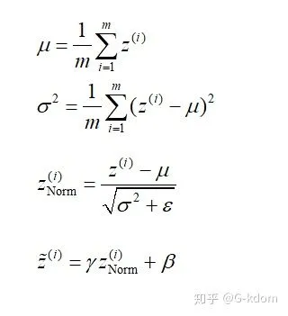  
</p>


**加入缩放和平移变量的原因是：保证每一次数据经过归一化后还保留原有学习来的特征，同时又能完成归一化操作，加速训练。** 这两个参数是用来学习的参数。

- **BN的作用**

（1）允许较大的学习率；

（2）减弱对初始化的强依赖性；

（3）保持隐藏层中数值的均值、方差不变，让数值更稳定，为后面网络提供坚实的基础；

（4）有轻微的正则化作用（相当于给隐藏层加入噪声，类似Dropout）

- **BN存在的问题**

（1）每次是在一个batch上计算均值、方差，如果**batch size太小**，则计算的均值、方差不足以代表整个数据分布。

（2）**batch size太大**：会超过内存容量；需要跑更多的epoch，导致总训练时间变长；会直接固定梯度下降的方向，导致很难更新。

### [Layer Normalization](https://arxiv.org/pdf/1607.06450v1.pdf)

Layer Normalization (LN) 的一个优势是**不需要批训练，在单条数据内部就能归一化**。LN不依赖于batch size和输入sequence的长度，因此可以用于batch size为1和RNN中。LN用于RNN效果比较明显，但是在CNN上，效果不如BN。

### [Instance Normalization](https://arxiv.org/pdf/1607.08022.pdf)

IN针对图像像素做normalization，最初用于图像的风格化迁移。在图像风格化中，生成结果主要依赖于某个图像实例，feature map 的各个 channel 的均值和方差会影响到最终生成图像的风格。所以对整个batch归一化不适合图像风格化中，因而对H、W做归一化。可以加速模型收敛，并且保持每个图像实例之间的独立。

### [Group Normalization](https://arxiv.org/pdf/1803.08494.pdf)

**GN是为了解决BN对较小的mini-batch size效果差的问题。**GN适用于占用显存比较大的任务，例如图像分割。对这类任务，可能 batch size 只能是个位数，再大显存就不够用了。而当 batch size 是个位数时，BN 的表现很差，因为没办法通过几个样本的数据量，来近似总体的均值和标准差。GN 也是独立于 batch 的，它是 LN 和 IN 的折中。

## HRNet

- 网络结构设计思路

<p align="center">
	  
</p>

- 不同于分类任务，人体姿态识别这类的任务中，需要生成一个高分辨率的heatmap来进行关键点检测。

<p align="center">
	  
</p>

- HRNet

  - 获取高分辨率的一般方式：先降分辨率，然后再升分辨率

    <p align="center">
    	  
    </p>

  - HRNet结构

    <p align="center">
    	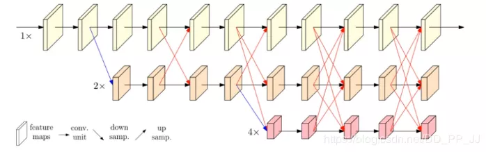  
    </p>

    - fusion

      <p align="center">
      	  
      </p>

      - 同分辨率的层直接复制。
      - 需要升分辨率的使用bilinear upsample + 1x1卷积将channel数统一。
      - 需要降分辨率的使用strided 3x3 卷积。
        - 至于为何要用strided 3x3卷积，这是因为卷积在降维的时候会出现信息损失，**<font color=green size=3>使用strided 3x3卷积是为了通过学习的方式，降低信息的损耗</font>**。所以这里没有用maxpool或者组合池化。
      - 三个feature map融合的方式是相加。

    - 输出特征融合

      <p align="center">
      	  
      </p>

      <p align="center">
      	  
      </p>

      - (a)图展示的是HRNetV1的特征选择，只使用分辨率最高的特征图。
      - (b)图展示的是HRNetV2的特征选择，将所有分辨率的特征图（小的特征图进行upsample）进行concate，**<font color=blue size=3>主要用于语义分割和面部关键点检测。</font>**
      - (c)图展示的是HRNetV2p的特征选择，在HRNetV2的基础上，**<font color=blue size=3>使用strided 3x3卷积是为了通过学习的方式，降低信息的损耗。</font>**
      - (d)图展示的是HRNetV2，采用上图的融合方式，**<font color=blue size=3>主要用于训练分类网络。</font>**

## Metric Learning

- AMSoftmax

  AMSoftmax属于Metric Learning——缩小类内距增大类间距的策略。下图形象的解释了Softmax 和 AMSoftmax的区别，Softmax能做到的只能是划分类别间的界线——绿色虚线，而AMSoftmax可以缩小类内距增大类间距，将类的区间缩小到Target region范围，同时又会产生margin大小的类间距。

<p align="center">
	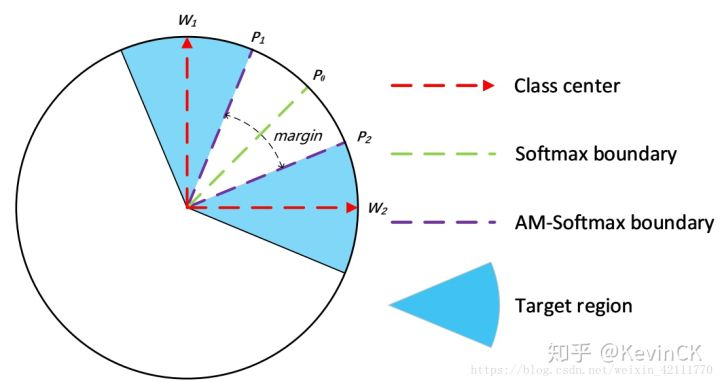  
</p>


<p align="center">
	  
</p>


## Attention & Transformer

### Attention

<p align="center">
	  
</p>

1. #### Attention机制的计算流程是怎样的？

   <p align="center">
   	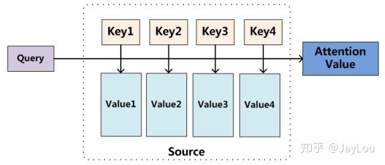  
   </p>

   ​		**Attention机制的实质其实就是一个寻址（addressing）的过程**，如上图所示：给定一个和任务相关的查询**Query**向量 **q**，通过计算与**Key**的注意力分布并附加在**Value**上，从而计算**Attention Value**，这个过程实际上是**Attention机制缓解神经网络模型复杂度的体现**：不需要将所有的N个输入信息都输入到神经网络进行计算，只需要从X中选择一些和任务相关的信息输入给神经网络。

   

   **注意力机制可以分为三步**

   1. **step1-信息输入**

      用**X** = [x1, · · · , xN ]表示N 个输入信息；

   2. **step2-注意力分布计算**

      令**Key**=**Value**=**X**，则可以给出注意力分布概率

      <p align="center">
      	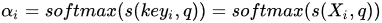  
      </p>

      **<font color=blue size=3>常见的注意力打分机制：</font>**缩放点积常用于self-attention模型

      <p align="center">
      	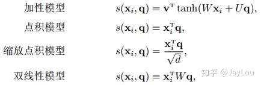  
      </p>

   3. **step3-信息加权平均**

      ​		注意力分布概率可以解释为在上下文查询**q**时，第i个信息受关注的程度，采用一种“软性”的信息选择机制对输入信息**X**进行编码为：

      <p align="center">
      	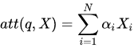  
      </p>

      ​		这种编码方式为**软性注意力机制（soft Attention）**，又可分为普通模式（**Key** == **Value** == **X**）和键值对模式（**Key！**=**Value**）。

      <p align="center">
      	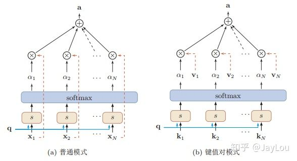  
      </p>

2. #### Attention机制的变种有哪些？

   1. 硬性注意力

   2. 键值对注意力

   3. 多头注意力

      ​		多头注意力（multi-head attention）是利用多个查询Q = [q1, · · · , qM]，来平行地计算从输入信息中选取多个信息。每个注意力关注输入信息的不同部分，然后再进行拼接：

      <p align="center">
      	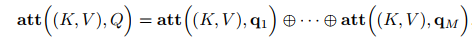  
      </p>

3. #### 一种强大的Attention机制：为什么自注意力模型（self-Attention model）在长距离序列中如此强大？

   1. 卷积或循环神经网络难道不能处理长距离序列吗？

      ​		当使用神经网络来处理一个变长的向量序列时，我们通常可以使用卷积网络或循环网络进行编码来得到一个相同长度的输出向量序列，如图所示：

      <p align="center">
      	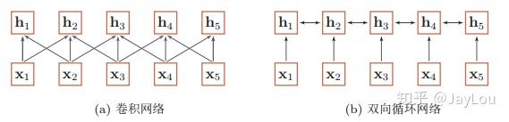  
      </p>

      ​		从上图可以看出，无论卷积还是循环神经网络其实都是对变长序列的一种“**局部编码**”：卷积神经网络显然是基于N-gram的局部编码；**<font color=green size=3>而对于循环神经网络，由于梯度消失等问题也只能建立短距离依赖。</font>**

   2. 要解决这种短距离依赖的“局部编码”问题，从而对输入序列建立长距离依赖关系，有哪些办法呢？

      <p align="center">
      	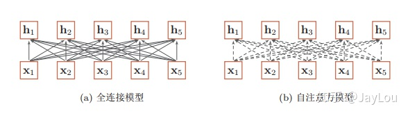  
      </p>

      ​		由上图可以看出，全连接网络虽然是一种非常直接的建模远距离依赖的模型， 但是无法处理变长的输入序列。不同的输入长度，其连接权重的大小也是不同的。

      ​		这时我们就可以利用注意力机制来“动态”地生成不同连接的权重，这就是**<font color=blue size=3>自注意力模型（self-attention model）</font>**。由于自注意力模型的权重是动态生成的，因此可以处理变长的信息序列。 

      ​		总体来说，**为什么自注意力模型（self-Attention model）如此强大**：**<font color=purple size=3>利用注意力机制来“动态”地生成不同连接的权重，从而处理变长的信息序列。</font>**

   3. 自注意力模型（self-Attention model）具体的计算流程是怎样的呢?

      1. 1. ​	给出信息输入：用X = [x1, · · · , xN ]表示N 个输入信息；通过线性变换得到为查询向量序列，键向量序列和值向量序列。**self-Attention中的Q是对自身（self）输入的变换，而在传统的Attention中，Q来自于外部。**

            <p align="center">
            	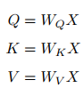  
            </p>

      <p align="center">
      	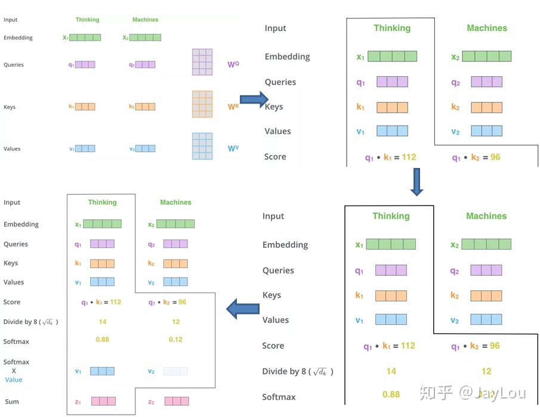  
      </p>

   4. Self Attention与传统的Attention机制非常的不同

      ​		传统的Attention是基于source端和target端的隐变量（hidden state）计算Attention的，**得到的结果是源端的每个词与目标端每个词之间的依赖关系**。但Self Attention不同，**它分别在source端和target端进行**，仅与source input或者target input自身相关的Self Attention，**捕捉source端或target端自身的词与词之间的依赖关系**；然后再把source端的得到的self Attention加入到target端得到的Attention中，捕捉source端和target端词与词之间的依赖关系。因此，self Attention比传统的Attention mechanism效果要好，主要原因之一是，传统的Attention机制忽略了源端或目标端句子中词与词之间的依赖关系，相对比，**self Attention可以不仅可以得到源端与目标端词与词之间的依赖关系，同时还可以有效获取源端或目标端自身词与词之间的依赖关系。**

### [Transformer](http://nlp.seas.harvard.edu/2018/04/03/attention.html)

<p align="center">
	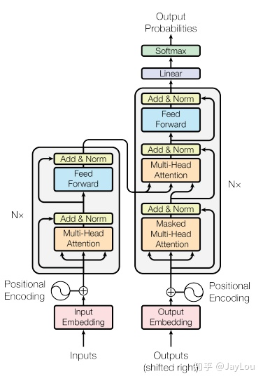  
</p>

1. Transformer Encoder

   <p align="center">
   	  
   </p>

   - **sub-layer-1**：**multi-head self-attention mechanism**，用来进行self-attention。

   - **sub-layer-2**：**Position-wise Feed-forward Networks**，简单的全连接网络，对每个position的向量分别进行相同的操作，包括两个线性变换和一个ReLU激活输出。

     每个sub-layer都使用了残差网络

     <p align="center">
     	  
     </p>

2. Transformer Decoder

   <p align="center">
   	  
   </p>

   - **sub-layer-1**：**Masked multi-head self-attention mechanism**，用来进行self-attention，与Encoder不同：由于是序列生成过程，所以在时刻 i 的时候，大于 i 的时刻都没有结果，只有小于 i 的时刻有结果，因此需要做**Mask**。
   - **sub-layer-2**：**Position-wise Feed-forward Networks**，同Encoder。
   - **sub-layer-3**：**Encoder-Decoder attention计算**。

3. Encoder-Decoder attention 与self-attention mechanism有哪些不同？

   ​		它们都使用了 multi-head计算，不过Encoder-Decoder attention采用传统的attention机制，其中的Query是self-attention mechanism已经计算出的上一时间i处的编码值，Key和Value都是Encoder的输出，这与self-attention mechanism不同。

4. multi-head self-attention mechanism具体的计算过程是怎样的？

   <p align="center">
   	  
   </p>

   ​		Transformer中的Attention机制由**Scaled Dot-Product Attention**和**Multi-Head Attention**组成，上图给出了整体流程。下面具体介绍各个环节：

   - **Expand**：实际上是经过线性变换，生成Q、K、V三个向量；
   - **Split heads**: 进行分头操作，在原文中将原来每个位置512维度分成8个head，每个head维度变为64；
   - **Self Attention**：对每个head进行Self Attention，具体过程和第一部分介绍的一致；
   - **Concat heads**：对进行完Self Attention每个head进行拼接；


## [Guide Anchoring](https://zhuanlan.zhihu.com/p/62933156)

## [Deformable Conv](https://zhuanlan.zhihu.com/p/62661196)

​		Deformable conv是对feature的每个位置学习一个offset。

<p align="center">
	  
</p>

<p align="center">
	  
</p>

## [核心开发者全面解读PyTorch内部机制](https://mp.weixin.qq.com/s/jEBn1__kt4njJR28Uhi_rw)   [英文](http://blog.ezyang.com/2019/05/pytorch-internals/)

<p align="center">
	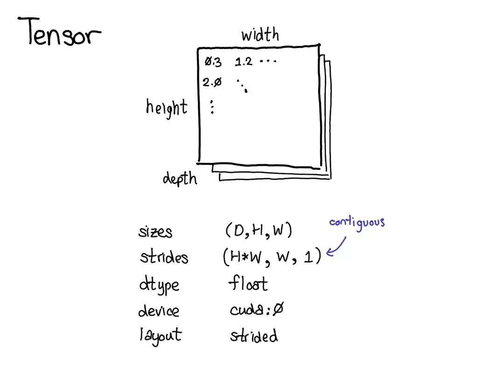  
</p>

## [语义分割的loss盘点](https://mp.weixin.qq.com/s/ra2qpFSbSuuJPDj39A5MWA)

<p align="center">
	  
</p>

**交叉熵Loss**

<p align="center">    
      
</p>

```python
#二值交叉熵，这里输入要经过sigmoid处理
import torch
import torch.nn as nn
import torch.nn.functional as F
nn.BCELoss(F.sigmoid(input), target)
#多分类交叉熵, 用这个 loss 前面不需要加 Softmax 层
nn.CrossEntropyLoss(input, target)
```


**带权交叉熵 Loss**

<p align="center">    
      
</p>

​		其中

<p align="center">    
    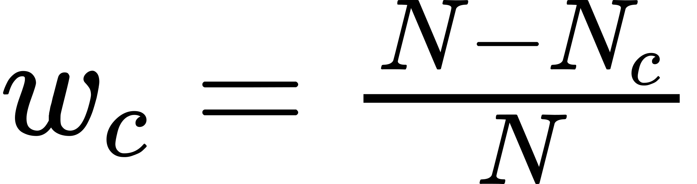  
</p>

**Focal Loss**

​		Focal Loss来解决**难易样本数量不平衡**，易分样本（即，置信度高的样本）对模型的提升效果非常小，模型应该主要关注与那些难分样本。损失函数训练的过程中关注的样本优先级就是**正难 > 负难 > 正易 > 负易**。目前**在图像分割上只是适应于二分类**。

<p align="center">    
      
</p>

```python
class FocalLoss(nn.Module):
    def __init__(self, gamma=0, alpha=None, size_average=True):
        super(FocalLoss, self).__init__()
        self.gamma = gamma
        self.alpha = alpha
        if isinstance(alpha,(float,int,long)): self.alpha = torch.Tensor([alpha,1-alpha])
        if isinstance(alpha,list): self.alpha = torch.Tensor(alpha)
        self.size_average = size_average

    def forward(self, input, target):
        if input.dim()>2:
            input = input.view(input.size(0),input.size(1),-1)  # N,C,H,W => N,C,H*W
            input = input.transpose(1,2)    # N,C,H*W => N,H*W,C
            input = input.contiguous().view(-1,input.size(2))   # N,H*W,C => N*H*W,C
        target = target.view(-1,1)

        logpt = F.log_softmax(input)
        logpt = logpt.gather(1,target)
        logpt = logpt.view(-1)
        pt = Variable(logpt.data.exp())

        if self.alpha is not None:
            if self.alpha.type()!=input.data.type():
                self.alpha = self.alpha.type_as(input.data)
            at = self.alpha.gather(0,target.data.view(-1))
            logpt = logpt * Variable(at)

        loss = -1 * (1-pt)**self.gamma * logpt
        if self.size_average: return loss.mean()
        else: return loss.sum()
```

**Dice Loss**

<p align="center">    
      
</p>

​		**不均衡的场景下的确好使**。有时使用dice loss会使训练曲线有时不可信，而且dice loss好的模型并不一定在其他的评价标准上效果更好，不可信的原因是梯度，对于softmax或者是log loss其梯度简化而言为 *p−t*，*t*为目标值，*p*为预测值。而dice loss为：

<p align="center">    
      
</p>

​		如果*p*、*t*过小则会导致梯度变化剧烈，导致训练困难。**Dice loss，对小目标是十分不利的**，因为在只有前景和背景的情况下，小目标一旦有部分像素预测错误，那么就会导致Dice大幅度的变动，从而导致梯度变化剧烈，训练不稳定。

```python
import torch.nn as nn
import torch.nn.functional as F

class SoftDiceLoss(nn.Module):
    def __init__(self, weight=None, size_average=True):
        super(SoftDiceLoss, self).__init__()
 
    def forward(self, logits, targets):
        num = targets.size(0)
        // 为了防止除0的发生
        smooth = 1
        
        probs = F.sigmoid(logits)
        m1 = probs.view(num, -1)
        m2 = targets.view(num, -1)
        intersection = (m1 * m2)
 
        score = 2. * (intersection.sum(1) + smooth) / (m1.sum(1) + m2.sum(1) + smooth)
        score = 1 - score.sum() / num
        return score
```

**Tversky Loss**

​		论文地址为：`https://arxiv.org/pdf/1706.05721.pdf`。实际上Dice Loss只是Tversky loss的一种特殊形式而已，我们先来看一下Tversky系数的定义，它是Dice系数和Jaccard系数（即IOU系数）的广义系数，公式为：

<p align="center">
	  
</p>

​		这里A表示预测值而B表示真实值。其中|A-B|代表FP（假阳性），|B-A|代表FN（假阴性），通过调整alpha和beta这两个超参数可以控制这两者之间的权衡，进而影响召回率等指标。

```python
def tversky(y_true, y_pred):
    y_true_pos = K.flatten(y_true)
    y_pred_pos = K.flatten(y_pred)
    true_pos = K.sum(y_true_pos * y_pred_pos)
    false_neg = K.sum(y_true_pos * (1-y_pred_pos))
    false_pos = K.sum((1-y_true_pos)*y_pred_pos)
    alpha = 0.7
    return (true_pos + smooth)/(true_pos + alpha*false_neg + (1-alpha)*false_pos + smooth)

def tversky_loss(y_true, y_pred):
    return 1 - tversky(y_true,y_pred)
```

**Dice + Focal loss**

​		Dice + Focal loss来处理小器官的分割问题。在前面的讨论也提到过，直接使用Dice会使训练的稳定性降低，而此处再添加上Focal loss这个神器。

<p align="center">
	  
</p>

## 空洞卷积

#### 空洞卷积的作用

- 扩大感受野

  ​		在deep net中为了增加感受野且降低计算量，总要进行降采样(pooling或s2/conv)，这样虽然可以增加感受野，但空间分辨率降低了。为了能不丢失分辨率，且仍然扩大感受野，可以使用空洞卷积。这在检测、分割任务中十分有用。**<font color=blue size=3>一方面感受野大了可以检测分割大目标，另一方面分辨率高了可以精确定位目标。</font>**但是，**<font color=red size=3>空洞卷积不适用于分类任务。</font>**

- 捕获多尺度上下文信息

  ​		空洞卷积有一个参数可以设置dilation rate，具体含义就是在卷积核中填充dilation rate-1个0。因此，**<font color=blue size=3>当设置不同dilation rate时，感受野就会不一样，也即获取了多尺度信息。</font>**多尺度信息在视觉任务中相当重要。

#### 空洞卷积gridding问题

​		空洞卷积是存在理论问题的，**<font color=blue size=3>论文中称为gridding，其实就是网格效应/棋盘问题。</font>**因为空洞卷积得到的某一层的结果中，邻近的像素是从相互独立的子集中卷积得到的，相互之间缺少依赖。

- 局部信息丢失

  ​		由于空洞卷积的计算方式类似于棋盘格式，某一层得到的卷积结果，来自上一层的独立的集合，没有相互依赖，因此该层的卷积结果之间没有相关性，即局部信息丢失。

- 远距离获取的信息没有相关性

  ​		由于空洞卷积稀疏的采样输入信号，使得远距离卷积得到的信息之间没有相关性，影响分类结果。

## [Understanding Convolution for Semantic Segmentation](https://blog.csdn.net/u011974639/article/details/79460893)

- DUC

  <p align="center">
  	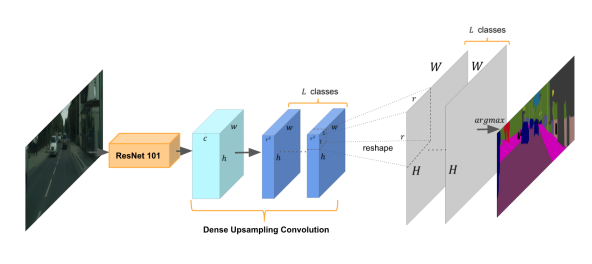  
  </p>	

  ​		设计**密集上采样卷积(dense upsampling convolution, DUC)**生成预测结果，这可以捕获在双线性上采样过程中丢失的细节信息。通过学习一些系列的放大的过滤器来放大降采样的feature map到最终想要的尺寸，就是将长宽尺寸上的损失通过通道维度来弥补。假设原图大小为 *(H,W,C)*，经过ResNet后维度变为 *(h,w,c)*，其中*h=H/r、w=W/r*，通过卷积后输出feature map维度为 *(h,w,r^2\*L)*，其中 *L* 是语义分割的类别数。最后通过reshape到 *(H,W,L)* 尺寸就可以了。

  ​		不难看出，DUC的主要思想就是将整个label map划分成与输入的feature map等尺寸的子部分。所有的子部分被叠加 *r^2* 次就可以产生整个label map了。这种变化允许我们直接作用在输出的feature map上而不用像deconvolution和unpooling那样还需要一些额外的信息。

- HDC

  ​		用一系列的dilation rates(hybrid dilation convolution, HDC)，而不是只用相同的rate，并且使用ResNet-101中blocks的方式连接它们。

## ASPP

<p align="center">
	  
</p>

<p align="center">
	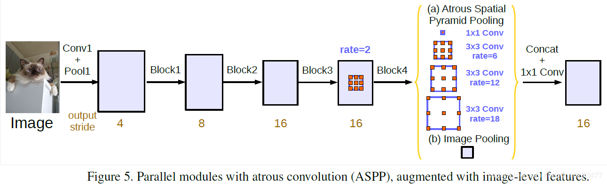  
</p>

1. Atrous Spatial Pyramid Pooling 一个1x1卷积和三个3x3的采样率为rates={6,12,18}的空洞卷积，滤波器数量为256，包含BN层。
2. Image Pooling 图像级特征，引入global context information：global average pooling–>1×1 conv + bn–>bilinearly upsample。

## Siamese Network

<p align="center">
	  
</p>

<p align="center">
	  
</p>

​		孪生神经网络（siamese network）中，其采用的损失函数是contrastive loss，这种损失函数可以有效的处理孪生神经网络中的paired data的关系。

<p align="center">
	  
</p>

<p align="center">
	  
</p>

代表两个样本特征的欧氏距离（二范数），P 表示样本的特征维数，Y 为两个样本是否匹配的标签，Y=1 代表两个样本相似或者匹配，Y=0 则代表不匹配，m 为设定的阈值，N 为样本个数。

​		这里设置了一个阈值ｍargin，表示我们只考虑不相似特征欧式距离在０～ｍargin之间的，当距离超过ｍargin的，则把其loss看做为０（即不相似的特征离的很远，其loss应该是很低的；而对于相似的特征反而离的很远，我们就需要增加其loss，从而不断更新成对样本的匹配程度）。

## Residual Network

#### residual block

<p align="center">
	  
</p>

​		**残差的引入去掉了主体部分，从而突出了微小的变化**。

#### bottle-neck block

<p align="center">
	  
</p>

​		在训练浅层网络的时候，我们选用前面这种，而如果网络较深(大于50层)时，会考虑使用后面这种(bottleneck)，这两个设计具有相似的时间复杂度。

#### residual unit

<p align="center">
	  
</p>

<p align="center">
	  
</p>

- **(a) original**：原始的结构
- **(b) BN after addition**：这是在做相反的实验，本来我们的目的是把ReLU移到旁路上去，这里反而把BN拿出来，这进一步破坏了主路线上的恒等关系，阻碍了信号的传递，从结果也很容易看出，这种做法不ok
- **(c) ReLU before addition**：将 *f* 变为恒等变换，最容易想到的方法就是将ReLU直接移动到BN后面，但这会出现一个问题，一个残差函数的输出应该可以是 实数空间，但是经过ReLU之后就会变为正实数，这种做法的结果也比 (a) 要差。

直接提上来似乎不行，但是问题反过来想， 在addition之后做ReLU，不是相当于在下一次conv之前做ReLU吗？

- **(d) ReLU-only pre-activation：**根据刚才的想法，我们把ReLU放到前面去，然而我们得到的结果和 (a) 差不多，原因是什么呢？因为这个ReLU层不与BN层连接使用，因此无法共享BN所带来的好处。
- **(e) full pre-activation：**那要不我们也把BN弄前面去，惊喜出现了，我们得到了相当可观的结果，是的，这便是我们最后要使用的Unit结构！！！

#### Separable Convolution

<p align="center">
	  
</p>

​		Separable Convolution核心思想是将一个完整的卷积运算分解为两步进行，分别为Depthwise Convolution与Pointwise Convolution。

<p align="center">
	  
</p>

<p align="center">
	  
</p>

```
参数量

N_std = 4 × 3 × 3 × 3 = 108

N_depthwise = 3 × 3 × 3 = 27
N_pointwise = 1 × 1 × 3 × 4 = 12
N_separable = N_depthwise + N_pointwise = 39
```

## OpenPose

<p align="center">
	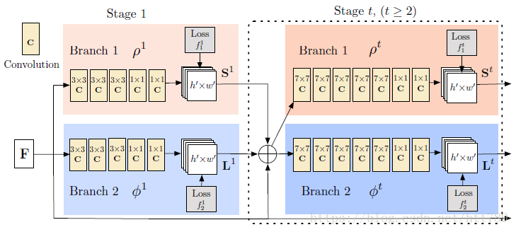  
</p>

#### loss

<p align="center">
	  
</p>

​	W(p)是一个二值掩码（取值0或1），当关键点不存在或者标签丢失时值为0，防止惩罚了true positive predictions。

#### 关键点热力图

- 维度

  <p align="center">
  	  
  </p>

- heatmap的生成

  <p align="center">
  	  
  </p>

  如果存在多个目标，则热力图中每个位置的值设置为**所有人中该关键点在该位置的最大值**。

#### Part Affinity Fields(部分亲和度向量场)

<p align="center">
	  
</p>

​		PAFs是一个2D矢量场，保留了位置和方向。表示一个肢体，由两个关键点构成，在肢体上的每个点是从一个关键点到下一个关键点的2D单位矢量。 ![[公式]](https://www.zhihu.com/equation?tex=x_%7Bj_1%2Ck%7D%2Cx_%7Bj_2%2Ck%7D) 表示ground truth中的关键点 *j1，j2* 的坐标，这两个关键点组成第 *k* 号人的一个肢体 *c*。如果一个点P在这个肢体上面，则P的值为 *j1* 指向 *j2* 的单位矢量；其他点都是零向量，如公式：

<p align="center">
	  
</p>

​		肢体 *c* 上的点满足：

<p align="center">
	  
</p>

其中：

1. <p align="left">
   	  
   </p>

2. δ表示肢体的宽度

   若某个像素点存在多个肢体，则取平均值：

   <p align="center">
   	  
   </p>

​        在测试阶段，关键点 *dj1,dj2* 和 PAF 沿着“关键点对”组成的线段计算上面 PAF 的线积分来度量这对“关键点对”的关联程度（亲和度）： 

<p align="center">
	  
</p>

<p align="center">
	  
</p>

​        在实践中，通过对 *u* 的均匀间隔采样来近似求积分。

## Seq2Seq

[全面解析RNN,LSTM,Seq2Seq,Attention注意力机制](https://zhuanlan.zhihu.com/p/135970560)

[完全解析RNN, Seq2Seq, Attention注意力机制](https://zhuanlan.zhihu.com/p/51383402)

## [总结-CNN中的目标多尺度处理](https://mp.weixin.qq.com/s?__biz=MzI5MDUyMDIxNA==&mid=2247489720&idx=3&sn=b8c749ad9261ed450135c25b4aaeea32&chksm=ec1ff541db687c5753974b5a8159b6e7e091aa085ad6d75d69281c6b29f0e5d0ba51f88579fd&scene=21#wechat_redirect)

视觉任务中处理目标多尺度主要分为两大类：

- **图像金字塔**
- **特征金字塔**：分析CNN中的多尺度问题，其实本质上还是去分析CNN的感受野，一般认为感受野越大越好，一方面，感受野大了才能关注到大目标，另一方面，小目标可以获得更丰富的上下文信息，降低误检。

## Meta Learning


## CenterNet


## YOLOv4

