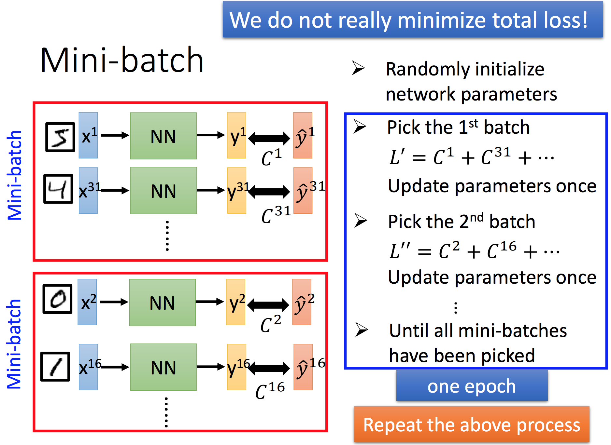

# 深度学习入门
- Batch Size
	

		
	

	
	- Speed
		- Smaller batch size means more updates in one epoch  
		- Mini-batch 比随机梯度下降收敛快的原因  
			对GPU而言，矩阵乘法运算和矩阵乘向量耗时几乎一致，在矩阵乘法中，每个元素都可以并行运算，因此 GPU & Mini-batch 会使效率大大提升。
	- Performance
		- Larger batch size can yield worse performance

- Shuffle the training examples for each epoch
	

		
	

