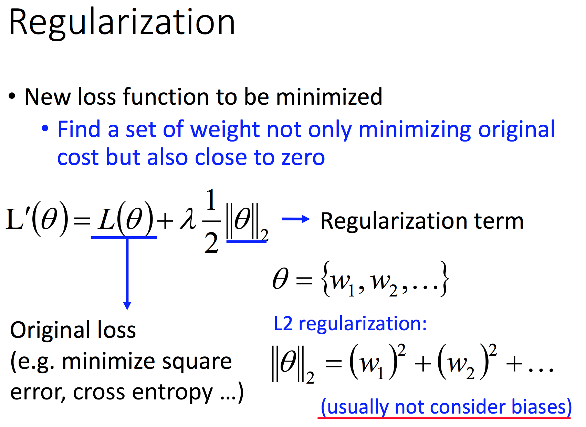

# 深度学习 Tips
- 深度学习一般过程  
	

		  
	

 
	图中 Testing Data 可近似理解为 Validing Data。

- 不同的策略用于不同的优化目标
	如：优化模型在 Testing Data 的表现，可以采用 dropout，但是此时模型在 Training Data 的表现会下降。

- 模型调优的方法
	

		  
	

- 深度学习训练常见问题
	- 激活函数选取  
		随着模型层数不断增加，结果不一定越来越优。这是因为：不同激活函数的选择，可能会导致梯度递减的问题。如，sigmoid 会使前面层对结果的影响越来越小。
		

			
		

	- 常用激活函数
		- ReLU
		- Leakly ReLU
		- Parametric ReLU  
			参数 alpha 亦可训练
		- Maxout 
	
	- 常用梯度下降优化方法
		- Adagrad
		- RMSProp
		- Adam  
			Adam = RMSProp + Momentum
		
	- Early Stopping  
		根据 Validation Set 输入模型的结果，获得 Validation Set 表现最好时的训练次数，选择最优训练次数对应的参数作为最终模型的参数。
		

			  
		

	
	- Regularization  
		

			  
		

	- Dropout  
		- 训练每个 mini-batch 前 resample the dropout neurons  
			- 每个神经元有 p% 的概率被丢弃
			- 训练部分神经元丢弃后结构改变的网络
			

				  
			

		
		- 验证时 No Dropout
			- 每个权重乘以 (100 - p)%
			

				  
			

