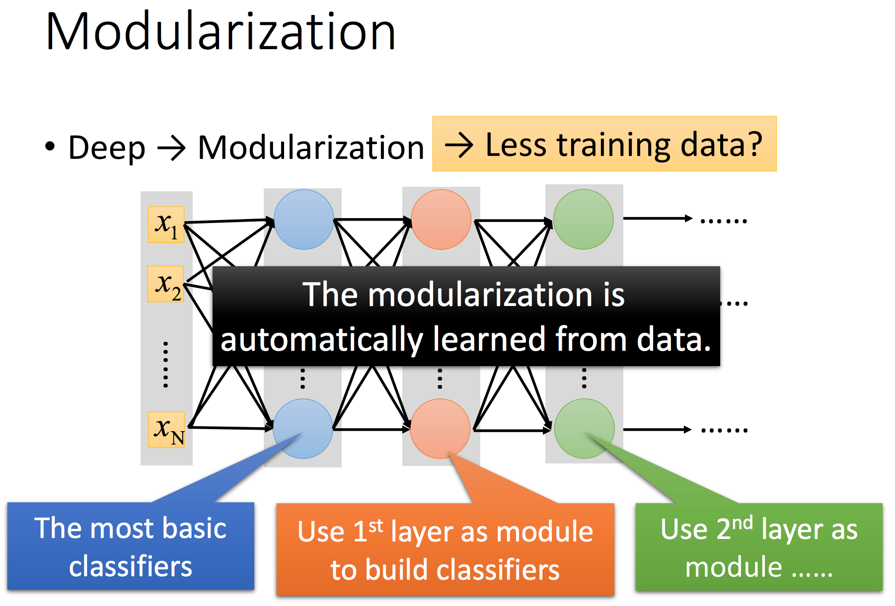

# Why Deep
- Modularization

	  

Modularization 逐层抽取特征，把本来复杂的问题变简单，即使 training data 没那么也能有较好的performance，因此 deep learning 相对所需的 training data 较少。

- Deep structure is more effective

	  

- End-to-end Learning

	  

去除依据理论或经验设置function的步骤，通过训练设计的深度学习网络，自己学习出这类function。